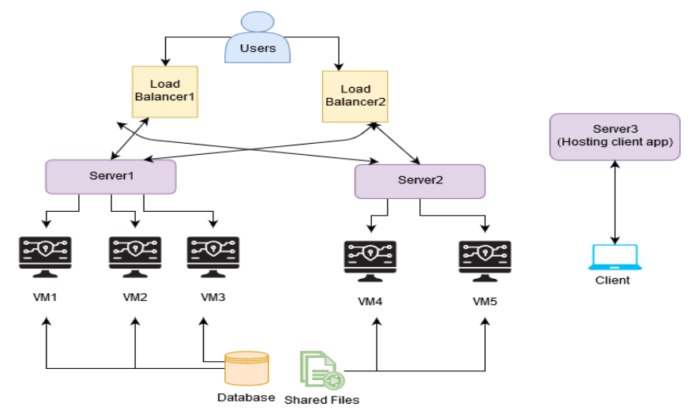

# Video-Streaming-Service

The architecture of our project setup is as shown in the figure below. 

### Following things are implemented in the project
* **REST API**

  The server-side API is implemented using Spring framework of Java. Server-side implementation is basically a REST service which responds to three different following URL endpoints.
  
  (1) `http://<server ip>:<port number>/movies`
  
  (2) `http://<server ip>:<port number>/movies/<movie id>`
  
  (3) `http://<server ip>:<port number>/movies/stream/<movie id>`
  
* **Load Balancer Api**

  All the HTTP requests are sent to the load balancer as shown in system architecture figure. And the load balancer reroutes the requests to the server which has minimum system usage. Total five servers are up and running the REST API applications inside the virtual machines.
  
* **Database and Media**

  All the media files (movie mp4 files) and a database file are stored in the shared glusterfs volume. Here SQLite database is used for its efficiency, reliability, and simplicity.

Note : For more details take a look at the Report.pdf in the repository.
